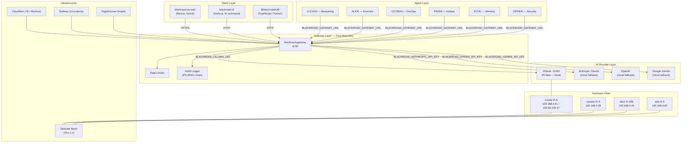
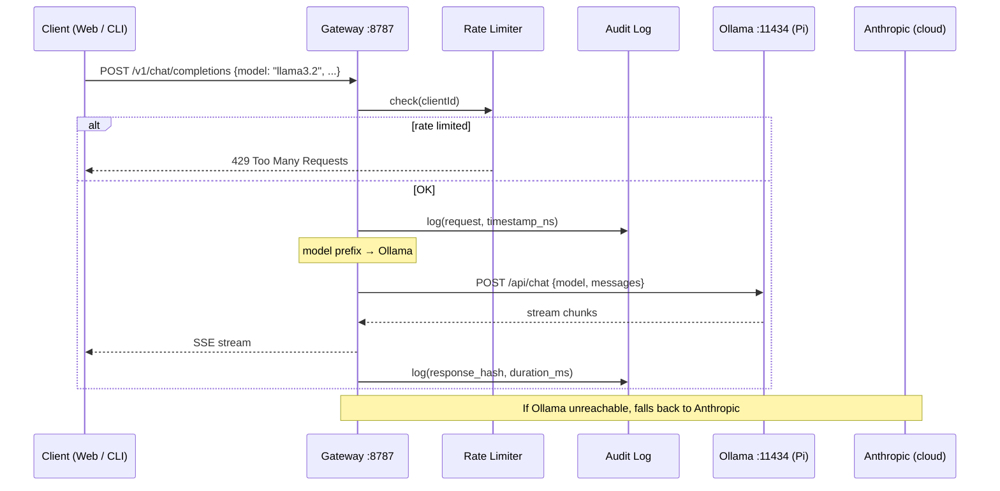
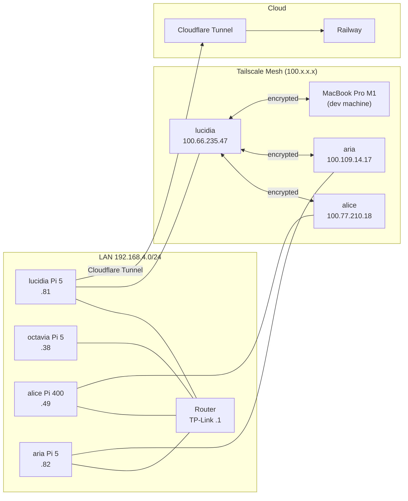

# BlackRoad OS — Architecture Overview

> Authoritative architecture reference for BlackRoad OS. All services, data flows, hardware topology, and security boundaries.

---

## System Context

BlackRoad OS is a **locality-first, tokenless AI platform**. Agents never hold provider credentials. All AI provider communication is proxied through a single gateway that owns all secrets.



---

## Component Descriptions

### Gateway (`blackroad-gateway`)

The single point of trust. All provider API keys live exclusively here, injected via environment variables at runtime.

- **Runtime:** Node.js / Hono on Railway or local
- **Port:** `8787` (binds `127.0.0.1` in dev, `0.0.0.0` in prod)
- **Provider routing:** model name prefix determines provider (see [API Reference](../api/gateway-api.md))
- **Memory:** PS-SHA∞ tamper-evident hash chain (SQLite)
- **Rate limiting:** sliding-window per client ID

### Agents

Six core agents, each with a distinct persona and capability set:

| Agent | Role | Strengths |
|-------|------|-----------|
| LUCIDIA | Reasoning | Deep analysis, philosophy, strategy |
| ALICE | Executor | Task execution, automation, code gen |
| OCTAVIA | DevOps | Infrastructure, deployment, monitoring |
| PRISM | Analyst | Data analysis, pattern recognition |
| ECHO | Memory | Knowledge retrieval, context management |
| CIPHER | Security | Threat detection, access validation |

Agents authenticate to the gateway only — never directly to providers.

### Pi Fleet (Hardware)

Local Ollama inference runs on Raspberry Pi nodes in the WireGuard/Tailscale mesh:

| Node | Hardware | IP (LAN) | IP (Tailscale) | Role |
|------|----------|----------|----------------|------|
| lucidia | Pi 5 8GB | 192.168.4.81 | 100.66.235.47 | Ollama + NATS brain |
| octavia | Pi 5 8GB | 192.168.4.38 | mesh | Storage + agents |
| alice | Pi 400 4GB | 192.168.4.49 | 100.77.210.18 | Auth + billing |
| aria | Pi 5 8GB | 192.168.4.82 | 100.109.14.17 | Web services |

See [Pi Fleet Runbook](../operations/PI_FLEET.md) for management procedures.

---

## Data Flow: Chat Request



---

## WireGuard / Tailscale Mesh Topology



---

## Security Model

```
[Internet]
    │
    ▼
[Cloudflare WAF + DDoS]
    │
    ▼
[Vercel / Railway] ──→ [Gateway :8787 (127.0.0.1 in dev)]
                                │
                        [Agents (no keys)]
                                │
                     [Ollama on Pi fleet (local)]
```

Key properties:

- **Tokenless agents** — agents hold zero provider credentials
- **Gateway-as-vault** — all `BLACKROAD_*` env vars injected at runtime, never in code
- **PS-SHA∞ audit log** — every request hashed into an append-only chain; entries cannot be deleted or backdated
- **Locality-first** — Ollama runs on Pi, no data leaves the LAN unless explicitly using cloud fallback
- **SSH keys only** on Pi fleet — password auth disabled

---

## Infrastructure Summary

| Layer | Technology | Count |
|-------|-----------|-------|
| CDN / Edge | Cloudflare Workers | 75+ |
| Web | Vercel | 15+ |
| API / Services | Railway | 14 projects |
| AI Inference | Raspberry Pi (Ollama) | 4 nodes |
| Storage | Cloudflare R2 | 135 GB |
| Tunnel | Cloudflare Tunnel | Pi → internet |
| IaC | Terraform + Ansible | blackroad-infra repo |
| Orchestration | Docker Compose | Pi fleet |

---

## Related Documents

- [Gateway API Reference](../api/gateway-api.md)
- [Pi Fleet Runbook](../operations/PI_FLEET.md)
- [Agent System Guide](../../ai/AGENTS.md)
- [Brand Design System](../brand/DESIGN_SYSTEM.md)
- [ADR-001: TypeScript Rewrite](../../architecture/decisions/ADR-001-typescript-rewrite.md)
- [ADR-002: Tokenless Gateway](../../architecture/decisions/ADR-002-tokenless-gateway.md)
